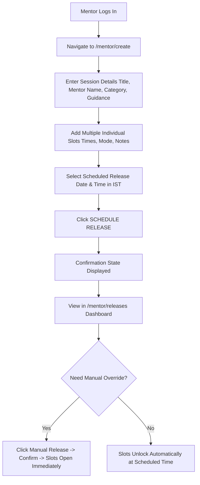
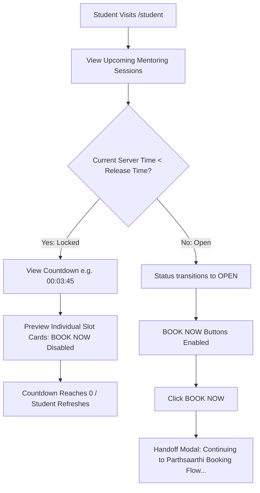

# Parthsaarthi — Scheduled Slot Release MVP
> **Campus Product Enhancement for IIM Lucknow Student Mentoring & SIP Portal**

---

## 1. Product Overview
**Parthsaarthi** is the premier student portal at the **Indian Institute of Management Lucknow (IIM Lucknow)** used by the junior MBA batch (~580 students) to book one-on-one mentoring, CV review, and Summer Internship Placement (SIP) preparation slots offered by senior batch mentors.

The **Scheduled Slot Release** feature is a high-impact architectural enhancement designed to automate the slot availability transition. Mentors set a predetermined release date and time once. When that scheduled second arrives, all slots automatically become bookable for students without requiring the mentor to manually return to the portal.

---

## 2. Problem Statement
In the existing Parthsaarthi system:
1. **Severe Supply Scarcity**: ~580 junior batch students actively compete for a small pool of mentoring slots (typically 4 to 15 slots per mentor).
2. **First-Come, First-Served (FCFS) Dynamics**: Slots are claimed within seconds of release.
3. **Communication vs. Reality Mismatch**: Mentors broadcast announcements on community channels (WhatsApp, Slack, MS Teams) specifying their session focus and intended release time (e.g., *"Case prep slots dropping at 2:00 PM today"*).
4. **Coordination Breakdown**: Because the actual release previously depended on the mentor manually logging into the portal and clicking release, mentors often got delayed by lectures, meetings, or forgot the exact minute.
5. **Student Frustration & Inequity**: Students sitting and refreshing at 2:00 PM either found nothing, gave up, or missed the slots when they were released haphazardly 20 minutes late.

---

## 3. MVP Scope & Boundaries
To deliver a robust, pitch-ready prototype without overengineering:
- **Scope Starts At**: The mentor creating and scheduling a release with multiple individual slots and an authoritative release timestamp.
- **Scope Ends At**: The scheduled time passing and the student's `[ BOOK NOW ]` buttons transitioning from disabled/locked to enabled/actionable upon page refresh.
- **Integration Boundary**: When an enabled `[ BOOK NOW ]` button is clicked, the application triggers a simulated modal demonstrating the seamless handoff back to the existing Parthsaarthi booking workflow (FCFS reservation, Google Meet link, and student calendar sync).
- **Explicitly Out of Scope**:
  - Payment gateways
  - Chat/messaging infrastructure
  - Real IIM campus LDAP/SSO authentication
  - Calendar integrations
  - Attendance management
  - Complex admin dashboards

---

## 4. Key Features
1. **Multi-Slot Session Creation**:
   - Mentors bundle multiple individual 30-minute consultation slots into a single structured release (e.g., 3:00 PM, 3:30 PM, 4:00 PM, 4:30 PM).
2. **Scheduled Release Timer (IST)**:
   - Mentors specify the exact release date and time in Indian Standard Time (`Asia/Kolkata`, UTC+5:30).
3. **Server-Authoritative Status Computation**:
   - Status is never reliant on fragile cron jobs or client-side clocks. If `serverTime >= releaseAt`, the release is authoritatively evaluated as `OPEN`.
4. **Student View with Real-Time Countdown**:
   - Clean academic design displaying session focus, mentor profile, slot count, release time callout, live `HH:MM:SS` countdown, and locked slot previews.
5. **Manual Release Fallback**:
   - Preserves mentor autonomy. If circumstances require early release or if an urgent update occurs, the mentor can trigger **Manual Release** via a confirmation dialog.
6. **Cancellation Immunity (Rule 7)**:
   - Cancelled releases are permanently safeguarded and will never unlock even if their original scheduled release timestamp has elapsed.
7. **Demo Simulation Controls**:
   - A dedicated floating review panel allowing interviewers/pitch evaluators to fast-forward release timing without waiting for real clock time.

---

## 5. User Flows

### Flow A: Senior Mentor Flow


### Flow B: Junior Student Flow


---

## 6. Tech Stack
- **Framework**: Next.js 14 (App Router)
- **Language**: TypeScript (`strict: true`)
- **Styling**: Tailwind CSS (Academic / Professional B-school UI palette)
- **Icons**: Lucide React
- **Database**: MongoDB Atlas with official Node.js driver (`mongodb` v6)
- **Fallback / Local Store**: Resilient in-memory MongoDB store with auto-seeding for zero-config evaluation.
- **Authoritative Timezone**: `Asia/Kolkata` (IST, UTC+5:30)

---

## 7. Architecture & Scalability
```
┌────────────────────────────────────────────────────────┐
│                   Next.js App Router                   │
├──────────────────────────┬─────────────────────────────┤
│  Client Components       │  Server Route Handlers      │
│  - SlotCard              │  - GET /api/releases        │
│  - ReleaseCard           │  - POST /api/releases       │
│  - Countdown             │  - GET /api/student/releases│
│  - StatusBadge           │  - POST /api/releases/[id]/ │
│  - DemoControls          │         manual-release      │
│  - DemoBookingModal      │  - POST /api/bookings       │
└────────────┬─────────────┴──────────────┬──────────────┘
             │                            │
             │ Fetch on page load/refresh │
             ▼                            ▼
┌──────────────────────────┐    ┌────────────────────────┐
│ Authoritative Evaluator  │    │ MongoDB Atlas / Engine │
│ computeReleaseStatus()   │◄───┤ Collections:           │
│ Current Server UTC vs    │    │ - releases             │
│ Stored releaseAt UTC     │    │ - slots                │
└──────────────────────────┘    │ - bookings             │
                                └────────────────────────┘
```

### Why No Cron Job? (Design Decision)
Traditional approaches often rely on cron jobs polling every minute to flip database flags from `scheduled` to `open`. This introduces:
1. Server process overhead and unreliability (if the worker crashes, releases stall).
2. Latency of up to 60 seconds.

**Parthsaarthi's Approach**:
We store the authoritative UTC timestamp `releaseAt`. Every read query evaluates:
$$\text{isOpen} = (\text{status} == \text{'manually\_released'}) \lor (\text{status} == \text{'scheduled'} \land \text{serverTime} \ge \text{releaseAt})$$
This guarantees sub-second mathematical correctness with zero background cron workers.

---

## 8. Database Collections & Schema

### `releases`
```typescript
interface Release {
  _id: string;               // e.g. "rel_x89f2a"
  mentorId: string;          // e.g. "mentor_rahul"
  mentorName: string;        // "Rahul Sharma"
  title: string;             // "Consulting Case Preparation"
  description: string;       // Guidance / prerequisites
  category?: string;         // "Management Consulting"
  releaseAt: string;         // UTC ISO string (e.g. "2026-10-07T08:30:00.000Z")
  status: 'scheduled' | 'open' | 'manually_released' | 'cancelled' | 'completed';
  createdAt: string;         // ISO 8601
  updatedAt: string;         // ISO 8601
  manuallyReleasedAt?: string;
  cancelledAt?: string;
}
```

### `slots`
```typescript
interface Slot {
  _id: string;               // e.g. "slot_case_01"
  releaseId: string;         // Foreign key referencing releases._id
  startTime: string;         // "03:00 PM"
  endTime: string;           // "03:30 PM"
  mode?: string;             // "Online (Google Meet)" or "Offline (SR-102)"
  location?: string;
  note?: string;             // "Profitability framework & live case"
  isBooked?: boolean;
  bookedBy?: string;
  createdAt: string;
}
```

### `bookings`
```typescript
interface Booking {
  _id: string;
  slotId: string;            // Unique index: one booking per slot
  studentId: string;         // "student_vaibhav"
  studentName?: string;      // "Vaibhav Raj Sahni"
  bookedAt: string;
}
```

---

## 9. Authentication Approach
- **Prototype Implementation**: Lightweight persona switcher accessible from `/login` or the navigation bar.
- **Roles**:
  - `Mentor Demo` (Rahul Sharma)
  - `Student Demo` (Vaibhav Raj Sahni)
- **Campus Alignment**: Clearly labeled with a "Demo Environment" banner. In production, this authentication boundary integrates cleanly with IIM Lucknow's Microsoft Office 365 / Google Workspace SSO.

---

## 10. Time & Timezone Handling
- **Target Timezone**: `Asia/Kolkata` (IST, UTC+5:30).
- **Storage**: All timestamps are converted to standard UTC ISO 8601 strings before writing to the database.
- **Presentation**: Timestamps are parsed and explicitly rendered in IST with clear labels (e.g., `02:00 PM IST`).
- **Security / Business Rule**: Client JavaScript time is never used for bookability decisions. The server evaluates its authoritative clock against `releaseAt`.

---

## 11. API Routes
| Method | Route | Description |
| :--- | :--- | :--- |
| `GET` | `/api/releases` | List all releases with slots count and computed status. |
| `POST` | `/api/releases` | Create a new session release and insert multiple slots. |
| `GET` | `/api/releases/[id]` | Fetch single release details and slot array. |
| `PATCH`| `/api/releases/[id]` | Update title, description, category, or releaseAt. |
| `POST` | `/api/releases/[id]/manual-release` | Trigger manual release fallback immediately. |
| `POST` | `/api/releases/[id]/cancel` | Cancel release (safeguarded against future unlock). |
| `POST` | `/api/releases/[id]/simulate-release` | Demo simulation: fast-forwards release timer to past. |
| `POST` | `/api/releases/simulate-all` | Demo simulation: fast-forwards all scheduled releases. |
| `GET` | `/api/student/releases` | Authoritative student view with bookable flags. |
| `POST` | `/api/bookings` | Atomic slot booking with server-side time verification. |
| `POST` | `/api/demo/reset` | Seed Consulting Case Prep demo session or reset DB. |

---

## 12. Hosting & Deployment
- Can be deployed to **Vercel**, **AWS Amplify**, or **Render** in 1 click.
- Environment variables required:
  - `MONGODB_URI`: MongoDB Atlas connection URI (`mongodb+srv://...`).
  - `NEXT_PUBLIC_TIMEZONE`: `Asia/Kolkata`.

---

## 13. Known Limitations
- Real WebSockets/live push updates are deliberately omitted as per the product specification (students refresh after countdown ends).
- Actual calendar syncing and automated Google Meet creation are simulated at the boundary.

---

## 14. Future Improvements
1. **Push Notifications**: WhatsApp / Email webhook triggers 5 minutes before scheduled release.
2. **Quota Throttling**: Limiting junior batch students to a maximum of 2 active mentor bookings per SIP cycle to prevent hoarding.
3. **Waitlist Queue**: High-throughput queue for slots cancelled by students.
